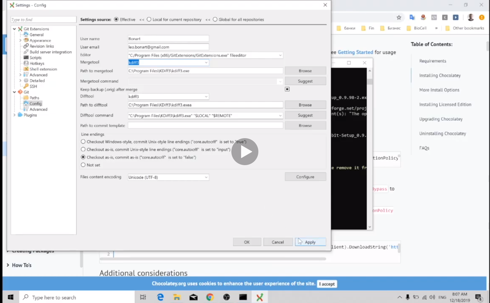
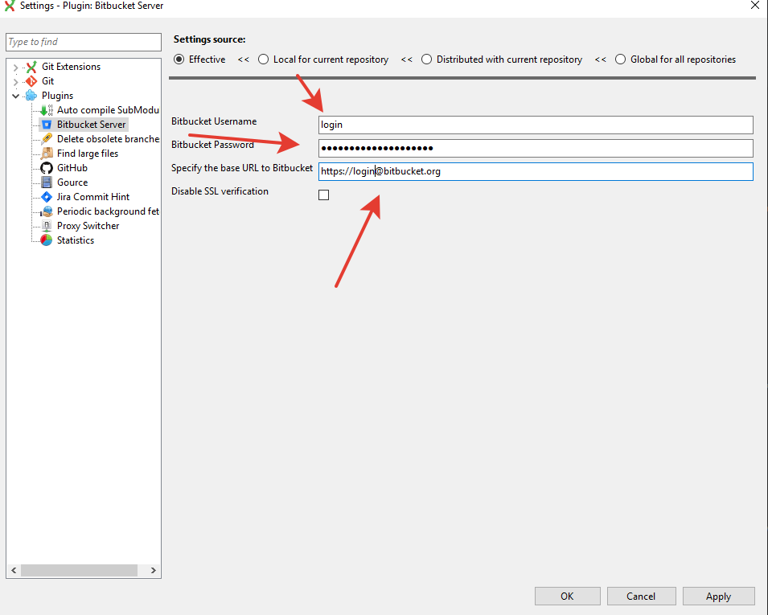
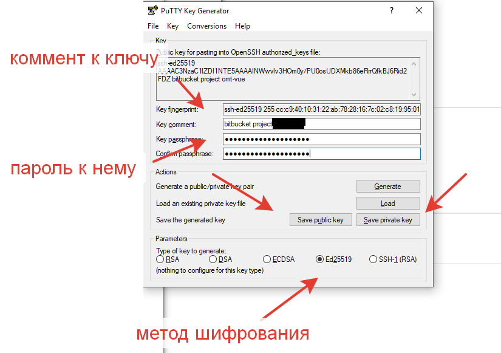
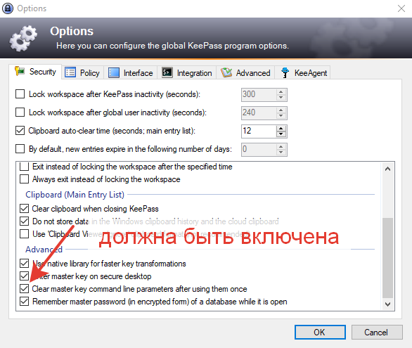
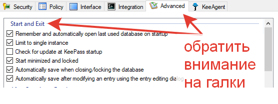
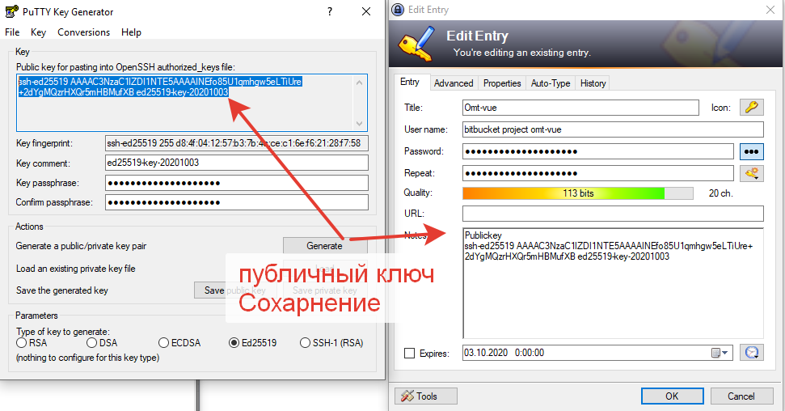
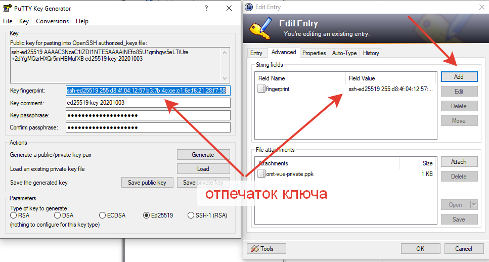
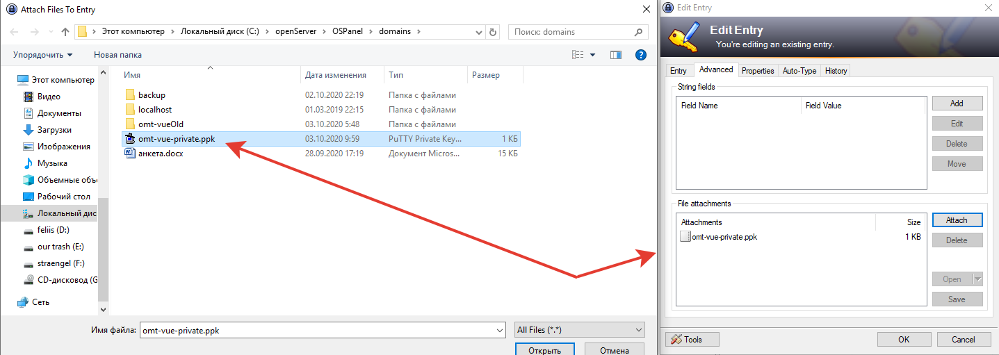
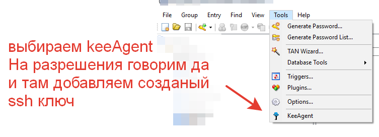

## Установка chocolate

Предпочитаемая программа для работы с гитом или битбакетов - chocolate.

**Установка chocolate для windows:**

- в cmd.exe под правами администратора ввести след.:
- @"%SystemRoot%\System32\WindowsPowerShell\v1.0\powershell.exe" -NoProfile -InputFormat None -ExecutionPolicy Bypass -Command "[System.Net.ServicePointManager]::SecurityProtocol = 3072; iex ((New-Object System.Net.WebClient).DownloadString('https://chocolatey.org/install.ps1'))" && SET "PATH=%PATH%;%ALLUSERSPROFILE%\chocolatey\bin" -> установка chocolate
- cup -y gitextensions -> установка приложения для взаимодействия с гитом
- cup -y kdiff3 -> смотреть версии между файлами, и объединять изменения двух файлов в третий, 
- настройке конфига программы на скрине 
- choco install githublink и choco install pullrequestreleasenotes - нужны для синхронизации с bitbacket

- Работаем с gitextension, на этом тут все

##Организация работы с репозиториями

Работать с репозиториями лучше через ssh ключи, для этого необходимо поставить putty. 
- Установка cup -y putty

Для генерации ключей используется puttygen и рекомендуется использовать шифрование Ed25519, 
так как оно более надежное и корткий ключ. 
Также необходимо защищать ключи паролем, 
так как при попадании закрытого ключа в плохие руки, 
дает возможность без проблем представляться 
Вами перед другими програмными системами. 

- Настройки для keepass  

- public key сохраняем в Notes, где лежит пароль.  

- fingerprint key - отпечаток ключа, с его помощью можно представляться другим ssh агентом. 

- private key сохарняется на диск и можно добавить в keepass, 
где сохранили пароль для ключей. После чего можно удалить private key из дериктории. 

После чего добавляем нужные ключи в репозиторий. 
В репозитории в настройках надо найти **ssh and GPG** для gita и **Access keys** для bitbacket, 
где происходит добавление.

После добавления ключа, его можно синхронизировать, так чтобы keepass сам отдовал необходимый ключ. 
Для этого надо поставить плагин для keepass (cup -y keepass). 

- В cmd ищем свежую версию clist keeagent и ставим cup -y keepass-plugin-keeagent --pre 

- Заходим в keepass во вкладке tools выбираем keeAgent, соглашаемся и добавляем наш ключ 

**Пометки**

    

---

