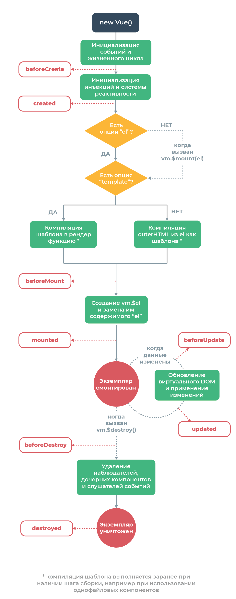

##Кратко о Vue

**[Назад](./../../README.md)**

- [Хуки жизненного цикла Vue.js сразу все](hookLifeCicle.md)
    - [Создание (инициализация): beforeCreate, created](create.md)
    - [Встраивание (вставка в DOM): beforeMount, mounted](mounted.md)
    - [Обновление (диффы и перерисовка): beforeUpdate, updated](updated.md)
    - [Уничтожение: beforeDestroy, destroyed](destroyed.md)
- [computed VS methods VS watch](computedMethodsWatch.md)
- [Структура приложения](structure.md)
- [Примеры](example-code.md)

##Элементы vue приложения

- [Компоненты](./vueComponent/readme.md)

##Жизненный цикл приложения vue

**[Назад](./../../README.md)**
